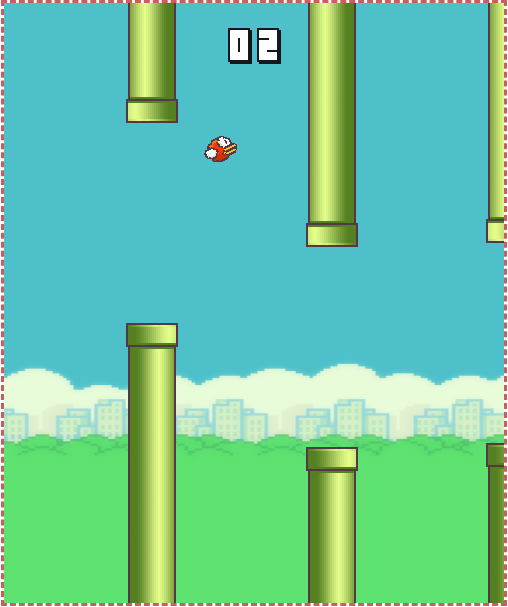

# FlappyBird
* To Start : `$ node flappy-bird-server.js` and search for `http://localhost:3000/` in Chrome  
* To Change Game Config : **./flappy-bird/config.js**  
* Game Control Button : **"SPACE"**
***
### Snapshot 

